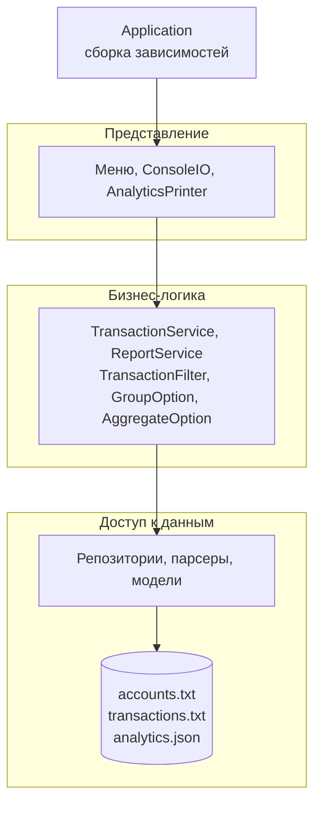

# TRANSACTION ANALYZER

.jpg)

> *Тысячи транзакций — одна понятная картина: фильтруй, группируй, считай и сохраняй отчёт.*

Консольное Java-приложение для анализа финансовых транзакций. Личный учебный проект и финальная работа курса «Продвинутый Java Core» для практики ООП, Stream API, обобщений, работы с файлами, обработки исключений и трёхзвенной архитектуры.

---

## Общее

| Параметр | Значение |
|---|---|
| **Тип** | Консольное приложение для аналитики транзакций |
| **Язык** | Java 21 |
| **Сборка** | Gradle (Wrapper) |
| **Источник данных** | Текстовые файлы со счетами и транзакциями |
| **Формат отчёта** | Консоль и JSON |
| **Разработчик** | Piperite Games |
| **Статус** | Учебный проект, завершён |

---

## Цель и аудитория

**Цель.** Быстро и надёжно превращать сырой поток транзакций в понятную аналитику: найти нужные операции, сгруппировать их по смыслу, посчитать итоги и сохранить отчёт.

**Аудитория.** Финансовые аналитики и управляющий персонал, которым нужны ясные и точные отчёты по транзакциям без ручной работы в таблицах.

---

## Реализованные функции

| Функция | Статус | Описание |
|---|---|---|
| **Загрузка данных** | ✅ | Чтение счетов и транзакций из файлов; пропуск пустых строк и комментариев `#`; при ошибке — имя файла, номер строки и причина |
| **Типы транзакций** | ✅ | `Regular`, `Taxable` (вычет налога), `ForeignCurrency` (перевод по курсу), `Recurrent` (повторы от раза в час до раза в год), `Commentable` (комментарии) |
| **Фильтр по категории** | ✅ | Точное совпадение с учётом регистра |
| **Фильтр по датам** | ✅ | Конечная дата включается целиком; повторяющиеся транзакции попадают в выборку, если любой их повтор приходится на диапазон |
| **Фильтр по сумме** | ✅ | Сравнение по реальной сумме — после налога и перевода валюты |
| **Фильтр по комментарию** | ✅ | Поиск подстроки без учёта регистра, только для транзакций с комментариями |
| **Группировка** | ✅ | По месяцам, годам, дню недели, категории, доходам и расходам, типу счёта, ID пользователя или без группировки |
| **Агрегация** | ✅ | Сумма, среднее значение, количество |
| **Вывод аналитики** | ✅ | Дата расчёта, фильтры, группировка, функция и результат в консоли |
| **Сохранение отчёта** | ✅ | Экспорт последнего расчёта в JSON; предупреждение, если аналитика ещё не рассчитана |
| **Обработка ошибок** | ✅ | Свои исключения для каждой бизнес-ошибки; неверный ввод в меню не роняет приложение |

## Возможные улучшения

| Функция | Статус | Описание |
|---|---|---|
| **Повторы в суммах** | ⏳ | Сейчас повторяющаяся транзакция учитывается в расчёте один раз (как допускает ТЗ); можно учитывать каждое выполнение |
| **Несколько отчётов** | ⏳ | Сохранять историю расчётов в один JSON вместо перезаписи |
| **База данных** | ⏳ | Новая реализация репозиториев без изменений в бизнес-логике и меню |

---

## Технический стек

| Задача | Решение |
|---|---|
| Язык | Java 21 |
| Сборка и зависимости | Gradle |
| Сокращение шаблонного кода | Lombok |
| Экспорт в JSON | Jackson (`jackson-databind`, `jackson-datatype-jsr310`) |
| Тесты | JUnit 5 |

Актуальные версии библиотек указаны в `build.gradle`.

---

## Входные данные

**Счета** — `ID счёта, тип счёта, ID пользователя`, где тип: `0` — текущий, `1` — сберегательный, `2` — кредитный.

```
10001,0,1
10002,1,1
10003,2,2
```

**Транзакции** — `ID счёта, ID транзакции, дата и время, категория, сумма, тип, дополнительные поля`.

```
10001,2,2020-01-01T12:00:00,Food,-25.50,Regular,
10002,8,2020-04-15T14:15:00,Salary,5000.00,Taxable,0.20
10001,6,2020-03-22T19:00:00,Entertainment,-45.00,ForeignCurrency,85
10001,16,2020-03-22T19:00:00,Subscription,-9.99,Recurrent,monthly;7
10003,22,2023-06-01T09:00:00,Books,-30.00,Commentable,Bought a book;Gift
```

| Тип | Дополнительные поля | Как считается сумма |
|---|---|---|
| `Regular` | — | Как в файле |
| `Taxable` | Ставка налога (`0.20`) | Сумма минус налог: 5000 → 4000 |
| `ForeignCurrency` | Курс к базовой валюте (`85`) | Сумма × курс: −45 → −3825 |
| `Recurrent` | Паттерн и число выполнений (`monthly;7`) | Как в файле, одно выполнение |
| `Commentable` | Комментарии через `;` | Как в файле |

В проекте два набора данных: `transactions.txt` повторяет пример из ТЗ, а `transactions-extended.txt` дополнительно содержит повторяющиеся транзакции, комментарии и транзакцию с несуществующим счётом.

---

## Архитектура

Проект построен по трёхзвенной архитектуре: каждый слой общается только со своим непосредственным соседом через интерфейсы.



| Слой | Ответственность |
|---|---|
| **`controller/`** | Консольные меню, ввод и вывод. Работает только с сервисами и ничего не знает о файлах и репозиториях |
| **`service/`** | Фильтрация, группировка, агрегация и подготовка отчёта. Опции и фильтр лежат здесь, поэтому бизнес-логика не зависит от интерфейса |
| **`data/`** | Модели, разбор строк файлов, чтение данных и запись JSON |
| **`exception/`** | Собственные исключения для каждой бизнес-ошибки |
| **`Application`** | Точка сборки: создаёт реализации всех слоёв и связывает их |

### Слой данных

| Модуль | Описание |
|---|---|
| **`model/`** | Счета, иерархия транзакций (абстрактная `Transaction` и наследники по типам), паттерны повторов, модель отчёта |
| **`parser/`** | Перевод строки файла в модель; любая ошибка формата превращается в понятное сообщение |
| **`repository/`** | Интерфейсы `AccountRepository`, `TransactionRepository`, `AnalyticRepository` и их файловые реализации |

### Принципы

- Каждый тип транзакции сам знает свою реальную сумму и даты выполнения — без `switch` по типам
- Расчёт аналитики — один стрим: фильтр → функция группировки → коллектор агрегации
- Деньги хранятся в `BigDecimal` и округляются до двух знаков по стандартным правилам; среднее не округляется
- Фильтр неизменяемый и проверяет диапазоны при создании
- Ошибка в данных останавливает загрузку с точным указанием строки, а не даёт молча неверный результат

---

## Структура папок

```
src/main/java/com/piperitegames/finance/
├── Application.java              # Точка входа и сборка зависимостей
├── controller/                   # Представление
│   ├── option/                   # Пункты меню
│   ├── AbstractMenuController    # Общий цикл любого меню
│   ├── MainMenuController
│   ├── SearchMenuController
│   ├── GroupMenuController
│   ├── AggregateMenuController
│   ├── AnalyticsPrinter          # Вывод аналитики
│   ├── AnalyticsSession          # Выбор пользователя и последний расчёт
│   └── ConsoleIO                 # Единственное место работы с консолью
├── service/                      # Бизнес-логика
│   ├── analytics/                # Группировка, агрегация, результат расчёта
│   ├── filter/                   # Фильтр транзакций
│   ├── TransactionService
│   └── ReportService
├── data/                         # Доступ к данным
│   ├── model/
│   ├── parser/
│   └── repository/
│       └── file/                 # Файловые реализации и запись JSON
└── exception/                    # Собственные исключения
```

---

## Тесты

| Файл | Что проверяет |
|---|---|
| `TransactionParserTest` | Разбор всех типов транзакций, налог и курс, повторы, запятые в комментариях, ошибки формата |
| `TransactionFilterTest` | Категория, даты с учётом повторов, сумма после налога, поиск по комментарию, неверные диапазоны |
| `DefaultTransactionServiceTest` | Все группировки и функции агрегации на данных из ТЗ, пример с фильтром, пустой результат, время расчёта |

---

## Пример

```
===================================
Дата: 2026-10-09 19:20:14
Расчёт: группировка по категории (подсчёт суммы)
Фильтр: начальная дата — 2020-01-01, конечная дата — 2021-05-11, минимальная сумма — -40, максимальная сумма — 1000
-----------------------------------
Аналитика:
  Food: -25.50
  Salary: 90.00
  Transport: -15.00
===================================
```

Сохранённый отчёт:

```json
{
  "date" : "2026-10-09T19:20:14",
  "groupOption" : "группировка по категории",
  "aggregateOption" : "подсчёт суммы",
  "filter" : "начальная дата — 2020-01-01, конечная дата — 2021-05-11, минимальная сумма — -40, максимальная сумма — 1000",
  "data" : {
    "Food" : -25.50,
    "Salary" : 90.00,
    "Transport" : -15.00
  }
}
```

---

## Запуск

1. Установить JDK 21
2. Запустить приложение, передав файл счетов, файл транзакций и имя выходного JSON:
```bash
   ./gradlew run --args="accounts.txt transactions.txt analytics.json"
```
3. В IntelliJ IDEA: конфигурация **Application**, класс `com.piperitegames.finance.Application`, в **Program arguments** — те же три имени файлов
4. Прогнать тесты:
```bash
   ./gradlew test
```